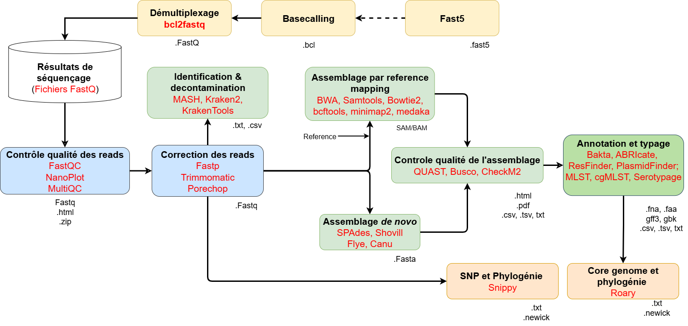
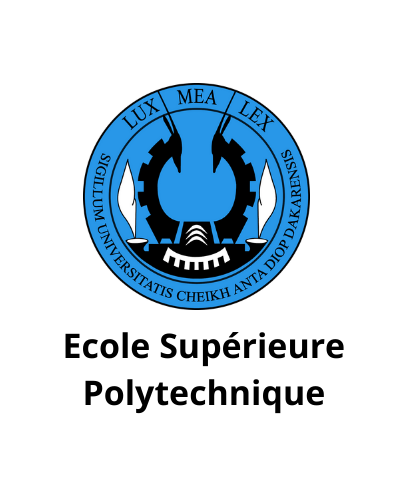

# Initiation à la Résistance aux Antimicrobiens (RAM) par la Bioinformatique

> Cours pratique destiné aux étudiants de **1ère année de Génie Biologique et Biotechnologies à l'Ecole Supérieure Polytechnique**  
> Niveau : débutant | Langage : ligne de commande Linuxm+ bash

---

## Description du cours

Ce cours vous introduit à l'utilisation des outils bioinformatiques pour l'étude de la **résistance aux antimicrobiens (RAM)**

À travers des exercices guidés, vous apprendrez à :

- Récupérer et contrôler la qualité de données génomiques bactériennes 
- Assembler un génome bactérien à partir de lectures courtes/longues (*short reads*)
- Identifier l'espèce bacterienne
- Évaluer la qualité de l'assemblage (contigs, N50, profondeur, GC%, completude, contamination,...)
- Identifier des gènes de résistance aux antibiotiques et mutations
- Typer et caractériser des souches bactériennes pathogènes

Aucune expérience préalable en bioinformatique n'est requise.

---
## Objectifs pédagogiques

À la fin de ce cours, l'étudiant sera capable de :

1. Naviguer dans un terminal Linux et exécuter des commandes de base
2. Mettre en place un environnement Conda reproductible
3. Exécuter un pipeline bioinformatique complet d'analyse de génome bactérien
4. Interpréter les résultats des outils de détection de gènes de résistance
5. Situer les résultats dans un contexte biologique et clinique
---

## Structure du dépôt

```
Formation-Bioinformatic-G2B/
├──README.md                  ← Ce fichier
├──environment.yml            ← Environnement Conda à installer
├──seqsero2.yml               ← Environnement Conda de SeqSero2
├──kraken2.yml                ← Environnement Conda de SeqSero2
├──workflow.html              ← Etapes de l'analyse bioinformatique
├──S1_ref.fasta               ← Fichier fasta de référence pour S1
├──S2_ref.fasta               ← Fichier fasta de référence pour S2
├──cours/
        ├──cours_bioinformatique_AMR-G2B.html
        ├──Installation_WSL.pdf
```
---

## Installation de l'environnement

### Prérequis

- [Miniconda](https://docs.conda.io/en/latest/miniconda.html) ou [Anaconda](https://www.anaconda.com/) installé
- Système Linux ou macOS (ou WSL2 sous Windows)
- Connexion internet

### Étapes d'installation

```bash
#1. Installation de git
sudo apt install -y git

# 2. Cloner le dépôt
git clone https://github.com/Osadio95/Formation-Bioinformatic-G2B.git
cd Formation-Bioinformatic-G2B

# 3. Créer l'environnement Conda
conda env create -f environment.yml
conda env create -f seqsero2.yml
conda env create -f kraken2.yml

# 4. Activer l'environnement
conda activate bioinformatic

# 5. Vérifier l'installation
fastqc --version
spades.py --version
amrfinder --version
fastp --version
multiqc --version
prefetch --version
mash --version 
quast --version
busco --version
amrfinderplus --version
mlst --version
ectyper --version
abricate --version

#.5  Datasets
Datasets disponibles sur Zenodo : https://zenodo.org/records/20627702
```

> La création de l'environnement peut prendre 15 à 30 minutes selon votre connexion.

---

## Outils utilisés

| Outil | Rôle | Étape du pipeline |
|---|---|---|
| `fastqc` | Rapport qualité des lectures FASTQ | Contrôle qualité |
| `fastp` | Trimming et filtrage des lectures | Contrôle qualité |
| `multiqc` | Rapport HTML agrégé | Contrôle qualité |
| `prefetch` / `sra-tools` | Téléchargement depuis NCBI SRA | Acquisition des données |
| `mash` | Comparaison et estimation de génomes | Exploration |
| `spades` | Assemblage de génomes bactériens | Assemblage |
| `quast` | Statistiques d'assemblage (N50, etc.) | Évaluation |
| `busco` | Complétude de l'assemblage | Évaluation |
| `abricate`| Détection des genes de résistances, virulence et réplicons plasmidiques | Annotation |
| `amrfinderplus` | Détection de gènes de résistance | Analyse RAM |
| `mlst` | Typage Multi-Locus Sequence Typing | Typage |
| `ectyper` | Sérotypage de *E. coli* | Typage |

---

## Pipeline bioinformatique



---

## Données utilisées dans le cours

Nous travaillons sur des génomes de bactéries pathogènes disponibles publiquement sur **NCBI SRA** :

- *Escherichia coli* (entérobactérie, modèle d'étude de la RAM)
- *Salmonella enterica* (pathogène entérique et important agent de toxi-infections alimentaires)

---

## Ressources complémentaires

### RAM et santé publique
- [OMS – Résistance aux antimicrobiens](https://www.who.int/fr/news-room/fact-sheets/detail/antimicrobial-resistance)
- [One Health – ANSES](https://www.anses.fr/fr/content/one-health-antibiotiques)
- [EARS-Net – Surveillance européenne de la RAM](https://www.ecdc.europa.eu/en/antimicrobial-resistance/ears-net)

### Bioinformatique
- [Bioinformatics Workbook](https://bioinformaticsworkbook.org/)
- [The Linux Command Line (gratuit en ligne)](https://linuxcommand.org/tlcl.php)
- [Galaxy Training Network](https://training.galaxyproject.org/) *(interface graphique pour débuter)*

### Bases de données de résistance
- [NCBI AMRFinder](https://www.ncbi.nlm.nih.gov/pathogens/antimicrobial-resistance/)
- [CARD – Comprehensive Antibiotic Resistance Database](https://card.mcmaster.ca/)
- [ResFinder](https://cge.food.dtu.dk/services/ResFinder/) *(outil en ligne)*

---

## Contribution et contact

Ce cours est en développement actif. Si vous trouvez une erreur ou souhaitez proposer une amélioration :

1. Ouvrez une *issue* sur ce dépôt GitHub
2. Ou contactez directement l'enseignant responsable

Les contributions des étudiants (corrections, suggestions, traductions) sont les bienvenues via *pull request*.

---

## Licence

Ce matériel pédagogique est distribué sous licence **Creative Commons CC BY-SA 4.0**.  
Vous êtes libre de l'utiliser, modifier et redistribuer à condition de citer la source et de conserver la même licence.

[](https://creativecommons.org/licenses/by-sa/4.0/)

---

 



*Cours développé pour le programme de Génie Biologique et Biotechnologies — mise à jour : 2026*
